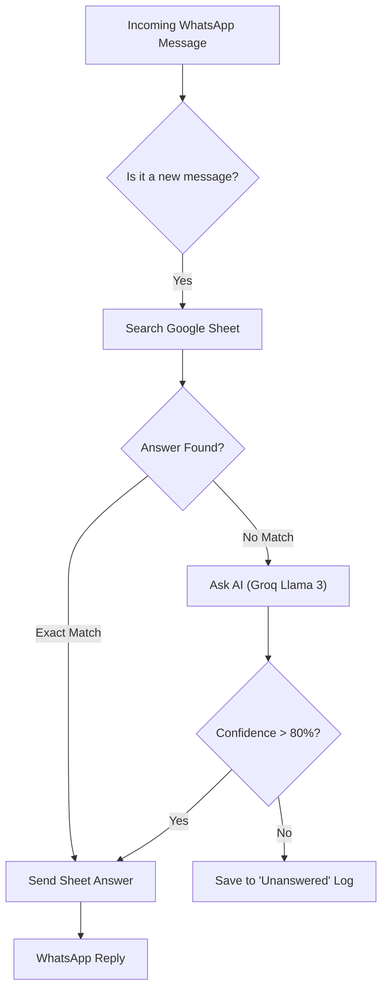

# WhatsApp Auto-Reply Bot (Q&A Edition) 🤖

**Automatically reply to pending WhatsApp messages using a Question-Answer Sheet.**

[](https://n8n.io/)
[]()
[](LICENSE)

---

## 📋 Overview

This bot is designed to handle **high volumes of pending messages** (2000+). It acts as a personal assistant that:
1.  Reads incoming WhatsApp messages.
2.  Checks a **Google Sheet** (or Excel) for a matching question/answer.
3.  Uses **Free AI (Groq)** to find the best answer if an exact match isn't found.
4.  Replies automatically.

**Perfect for:**
- Influencers/Business owners with overloaded inboxes.
- Customer support handling FAQs.
- Personal WhatsApp accounts (via Waha Bridge).

---

## 📊 Architecture



---

## ✨ Features

- **✅ Completely Free Mode**: Uses `Waha` (Local WhatsApp API) + `Groq` (Free AI) + `Google Sheets`.
- **✅ Excel/Sheet Knowledge Base**: You control the brain. Just add rows to the sheet.
- **✅ Smart Matching**: Doesn't need exact phrasing. AI understands similar questions.
- **✅ Safety First**: Logs unmatched questions for you to review (so it doesn't hallucinate).
- **✅ Batch Processing**: Can handle bulk replies without getting banned (rate limits included).

---

## 🎯 Use Cases

### 1. Personal Brand Management
- **Problem**: 2,000+ unread DMs asking "What services do you offer?"
- **Solution**: Bot replies instantly with your service portfolio from the Sheet.

### 2. E-commerce Support
- **Problem**: Repetitive questions like "Where is my order?" or "Refund policy?"
- **Solution**: Bot directs them to the order tracking page or sends the policy text.

### 3. Event Management
- **Problem**: Guests asking same questions about venue, time, and parking.
- **Solution**: Bot automates replies so you can focus on the event.

---

## 🪜 Workflow Steps

1.  **Trigger**: `WAHA` detects a new incoming message.
2.  **Lookup**: Workflow searches column A of your Google Sheet.
3.  **Match**: 
    - **Exact**: If found, it pulls the answer from column B.
    - **Fuzzy (AI)**: If not found, `Groq` (Llama 3) analyzes the Sheet's content to generate a relevant answer.
4.  **Reply**: The answer is sent back via WhatsApp.
5.  **Fallback**: If AI is unsure, it logs the question to a "To Review" sheet for you.

---

## 📈 Automation Benefits

-   **⏱️ Zero Backlog**: Clears 2,000+ messages in hours, not days.
-   **💰 100% Free**: No recurring costs for AI or WhatsApp API.
-   **🧠 Smarter Over Time**: Add new Q&A pairs to your sheet to make the bot smarter instantly.
-   **🔒 Data Privacy**: Messages stay on your local server/Docker interaction, not a 3rd party SaaS.

---

## 🛠️ Tech Stack (Free)

| Component | Technology | Cost |
|-----------|------------|------|
| **Automation Core** | n8n (Self-Hosted) | Free |
| **WhatsApp API** | **WAHA** (WhatsApp HTTP API) | Free (Docker) |
| **AI Model** | **Groq** (Llama 3 70B) | Free |
| **Database** | Google Sheets | Free |

---

## 🚀 Setup Guide

### 1. Preparation
1.  **Google Sheet**: Create a sheet with two columns: `Question` and `Answer`.
2.  **Groq API**: Get a free key from [console.groq.com](https://console.groq.com).

### 2. Run with Docker
This setup uses **WAHA** (a free tool that runs a WhatsApp Web instance in Docker).

1.  **Clone the Repo**:
    ```bash
    git clone https://github.com/RayeesYousufGenAi/whatsapp-qa-bot.git
    cd whatsapp-qa-bot
    ```

2.  **Start Services**:
    ```bash
    docker-compose up -d
    ```

3.  **Scan QR Code**:
    - Go to `http://localhost:3000/dashboard`
    - Scan the QR code with your WhatsApp (Linked Devices).

### 3. Import Workflow
1.  Open n8n (`http://localhost:5678`).
2.  Import `workflow.json`.
3.  Connect your **Google Sheets** and **Groq** credentials.
4.  Active the workflow!

---

## ⚠️ Important Notes
- **Rate Limits**: The workflow includes a "Wait" node to prevent spamming. Do not set it lower than 10-20 seconds per message.
- **Privacy**: Since this uses a local bridge (Waha), your data stays on your server.

---

## 👤 Author

**Rayees Yousuf**
- GitHub: [@RayeesYousufGenAi](https://github.com/RayeesYousufGenAi)
